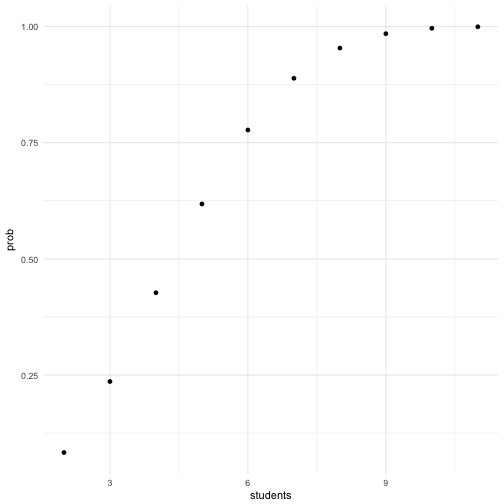

## 先找到计算公式


```r
get_prob <- function(n) {
  # 基本事件总数
  all_events <- 12 ^ n;

  # 生日不重复的数量
  no_repeat <- factorial(12) / factorial(12 - n);

  round(1 - no_repeat / all_events, 4);
}
```

## 存储10到100的样本


```r
df <- data.frame(students = c(2:11));

df;
```

```
##    students
## 1         2
## 2         3
## 3         4
## 4         5
## 5         6
## 6         7
## 7         8
## 8         9
## 9        10
## 10       11
```

## 计算每个样本对应的概率


```r
df$prob <- get_prob(df$students);

df;
```

```
##    students   prob
## 1         2 0.0833
## 2         3 0.2361
## 3         4 0.4271
## 4         5 0.6181
## 5         6 0.7772
## 6         7 0.8886
## 7         8 0.9536
## 8         9 0.9845
## 9        10 0.9961
## 10       11 0.9994
```

## 绘制概率变化图


```r
library('ggplot2');

ggplot(df, aes(x = students, y = prob)) +
  geom_point() +
  theme_minimal();
```


